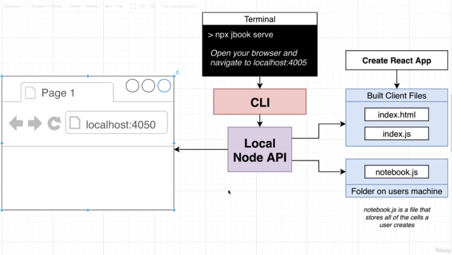

# typescript-react-projects

React and Typescript: Build a Portfolio Project by Stephen Grider

## Folder structure

1. 01-rts: React TypeScript
2. 04-redux-ts: Redux
3. 06-code-transpiling
   - bundler: to observe main.js file after Webpack bundling
4. 07-esbuild
   - jbook: a demo app using esbuild
   - react-17.0.2-package: https://registry.npmjs.org/react/-/react-17.0.2.tgz
5. 10-untrusted-code-execution
   - jbook: extended from last lecture
6. After that, all directories have jbook copied from the previous section until 21-path-Lerna
7. 21-path-Lerna
   - jbook
     - packages
       - cli
       - local-api
       - local-client: the previous jbook react app is here
8. After that, all directories have jbook copied from the previous section

# Details

<details open> 
  <summary>Click to Contract/Expend</summary>

## Section 1: React with Typescript

### 4. Generating TypeScript-Enabled Projects

```sh
npx create-react-app 01-rts --template typescript
```

## Section 2: Types Around Props and State

### 7. The Big Difference with Props

Two Big Checks By TypeScript

1. Parent: Are we providing the correct props to Child when we show it in Parent?
2. Child: Are we using the correctly named + typed props in Child?

### 8. Explicit Component Type Annotations

React Component Properties

1. propTypes
2. displayName
3. defaultProps
4. contextTypes

```js
export const ChildAsFC: React.FC<ChildProps> = ({ color }) => {};
// 1. 'Child' will be a React function component
// 2. 'Child' might have properties assigned to it like 'propTypes' and 'contextTypes'
// 3. 'Child' will receive props of type 'ChildProps'
```

### 9. Annotations with Children

```js
export const ChildAsFC: React.FC<ChildProps> = ({ color }) => {};
// React.FC accepts children without type define
```

## Section 3: Types Around Events and Refs

### 19. Applying Types to Refs

```js
const inputRef = (useRef < HTMLInputElement) | (null > null);
```

## Section 4: Typescript with Redux

### 21. App Overview

```sh
npx create-react-app 04-redux-ts --template typescript
```

### 22. Project Setup

Taking a new branch redux-ts-latest-packages to install latest packages

```sh
# npm install --save-exact @types/react-redux@7.1.15 axios@0.21.1 react-redux@7.2.2 redux@4.0.5 redux-thunk@2.3.0
npm install --save axios react-redux redux redux-thunk
npm install --save-dev @types/react-redux
```

### 23. Redux Store Design

[NPM Search API](https://registry.npmjs.org/-/v1/search?text=react)

> We will create redux/index.ts as an end point, \
> and to prevent connecting to all different reducers/actions and so on

### 28. Applying Action Interfaces

```js
// Type Guard
if (action.type === 'search_repositories_success') {
  // 100% certainty that 'action' satisfies the
  // SearchRepositoriesSuccessAction interface
}
```

### 31. Adding Action Creators

Since TypeScript 4.4, errors are automatically cast as unknown\
https://stackoverflow.com/questions/60151181/object-is-of-type-unknown-typescript-generics

```js
// Error message: Object is of type 'unknown'.
payload: err.message,
```

There are 2 ways to go

1. Type guard

   ```js
   try {
   } catch (err) {
     let errorMessage = 'Failed to do something exceptional';
     if (err instanceof Error) errorMessage = err.message;

     dispatch({
       type: ActionType.SEARCH_REPOSITORIES_ERROR,
       payload: errorMessage,
     });
   }
   ```

2. Change tsconfig.json option
   ```json
   {
     "useUnknownInCatchVariables": false
   }
   ```

### 41. Awkward Typings Around React-Redux

- [Redux Style Guide: Use Static Typing](https://redux.js.org/style-guide/style-guide#use-static-typing)
- [Redux: Static Typing](https://react-redux.js.org/using-react-redux/usage-with-typescript#define-root-state-and-dispatch-types)

```js
// 04-redux-ts/src/state/reducers/index.ts
export type RootState = ReturnType<typeof reducers>;
```

To let TypeScirpt know the type of the Root State when using _useSelector_

### 42. Creating a Typed Selector

[Redux: Defin Typed Hooks](https://react-redux.js.org/using-react-redux/usage-with-typescript#define-typed-hooks)

```js
// 04-redux-ts/src/hooks/useTypedSelector.ts
export const useTypedSelector: TypedUseSelectorHook<RootState> = useSelector;
```

> Some of these libraries make TypeScript integration unnecessarily difficult.\
> But we have to deal with it in the javascript world.

> I think this is where I gave up when I tried to learn this course 7 months ago for the first time. \
> Fortunately, I'm dealing it better this time.

## Section 5: The Big App - Here's What We're Building!

### 46. Three Big Challenges

1. Code will be provided to Preview as a string. We have to execute it safely.
2. This code might have advanced JS syntax in it (like JSX) that your browser can't execute.
3. The code might have import statements for other JS files or CSS. We have to deal with those import statements before executing the code.

## Section 6: Code Transpiling in the Browser

### 47. Transpiling Options

1. React App (Code) <-> Backend API Server (Transpiled Code)
2. React App; In-Browser Transpiler (Code <-> Transpiled Result)

### 49. Module Systems

1. AMD: define(['dep'], (dep) => {});
2. common js: require/module.exports
3. ES Modules: import/export

- Transpiler: Babel
- Budnler: Webpack

### 50. Behind the Scenes with Webpack

```sh
mkdir bundler
npm init -y
npm install --save-exact webpack@5.11.1 webpack-cli@4.3.0
```

```json
// inline-source-map: just not to
{
  "build": "webpack --mode=development --devtool=inline-source-map"
}
```

```sh
npm run build
# The code is written in 'commonjs'
```

```js
// ./dist/main.js
var webpack_modules = {
  './src/message.js': (module) => {
    module.exports = 'Hi there';
  },
};
function webpack_require(moduleId) {
  var moduleFn = webpack_modules[moduleId];
  // Create a new module
  var module = { exports: {} };
  // Execute the module function
  moduleFn(module);
  // Return the exports of the module
  return module.exports;
}

// ./src/index.js
const message = webpack_require('./src/message.js');
console.log(message);
```

### 51. Webpack with ES Modules

Change the commonjs syntax to ES module syntax import/export \
`npm run build` \
the `./dist/main.js` looks different from the commonjs one.

### 53. Options for Bundling

1. Bundling Option #1: it doesn't seem quite right
   1. React App -> code to Backend API Server
   2. Backend API Server
      1. Webpack Runs
      2. Webpack finds missing module
      3. npm install pluging gets module
         - NPM registry
         - [NpmInstallWebpackPlugin](https://v4.webpack.js.org/plugins/npm-install-webpack-plugin/)
      4. Bundle complete!
   3. Bundled Code to React App
2. Bundling option #2: better solution than option #1
   1. React App -> code to Backend API Server
   2. Backend API Server
      1. (same)
      2. Webpack finds an import statement
      3. We write plugin to fetch individual file from npm
         - NPM registry
      4. (same)
   3. (same)
3. Bundling option #3: same as option #2, but only in React App
   1. React App
      1. Webpack Runs
      2. Webpack finds an import statement
      3. We write plugin to fetch individual file from npm
         - NPM registry
      4. Bundle complete!

### 54. So Which Approach?

Transpiling/Bundling Remotely or Locally?

1. Remote: Backend API Server
   1. We can cache downloaded NPM modules to bundle code faster
   2. Will work better for users with slow devices or limited internet connections
2. Local: React App
   1. Removes an extra request to the API server
      - faster code execution!
   2. We don't have to maintain an API server!
   3. Less complexity
      - no moving code back and forth

We are going with option #3: Everything in the React App

> One small problem: Webpack doesn't work in the browser...

### 55. A Webpack Replacement

Babel (Works in the browser) + Webpack (Doesn't work) \
-> ESBuild : ESBuild can transpile + bundle our code - all in the browser!

- [ESBuild - Github](https://github.com/evanw/esbuild)
- [ESBuild - Homepage](https://esbuild.github.io/)

ESBuild is significantly fast!

## Section 7: Implementing In-Browser Bundling

### 56. A Demo App

```sh
npx create-react-app jbook --template typescript
```

### 57. Project Setup

```sh
# npm install --save-exact esbuild-wasm@0.8.27
# wasm: Web Assembly
npm install --save esbuild-wasm
# "esbuild-wasm": "^0.13.12",
```

### 59. Understanding ESBuild

- ESBuild is built in Go language
- So how this pakcage understans my javascript code?
- We installed `esbuild-wasm` which is esbuild web assembly.
- This WASM(web assembly) binary has Go Lang bundler which complies to work in the browser

Copy esbuild.wasm to my work directory\
`cp 07-esbuild/jbook-demo-app/node_modules/esbuild-wasm/esbuild.wasm 07-esbuild/jbook-demo-app/public`

### 61. Using Refs for Arbitrary Values

[ESBuild - Running in the browser](https://esbuild.github.io/api/#running-in-the-browser)

### 62. Transpiling Works!

[ESBuild - Transform API](https://esbuild.github.io/api/#transform-api)

### 63. Troubles with Bundling in the Browser

ESBuild will look at the file system and find the modules first.\
But we are running esbuild in the browser, so it cannot find the modules there.\
-> We need to write plugin to fetch individual file(=module) from npm

### 64. Issues with NPM

```sh
npm view react dist.tarball
# https://registry.npmjs.org/react/-/react-17.0.2.tgz
# This address is where you reach when `npm install`
```

Download react-17.0.2.tgz, uncompress and have a look.\
`./07-esbuild/react-17.0.2.package`

### 65. Solution with Unpkg

Directly fetching npm package would cause a CORS error.\
(It didn't come to me though unlike the lecture shows)

So we can use UNPKG

[UNPKG - download npm package](https://unpkg.com/)

### 68. Deep Dive on Bundling

[ESBuild Plugins - DOC](https://esbuild.github.io/plugins/)

ESBuild Bundling Process

1. onResolve step: Figure out where the index.js file is stored
2. onLoad step: Attempt to load up the index.js file
3. Parse the index.js file, find any import/require/exports
4. onResolve step: If there are any import/require/exports, figure out where the requested file is
5. onLoad step: Attmept to load that file up

## Section 8: Dynamic Fetching and Loading of NPM Modules

### 71. Dynamically Fetching Modules

```sh
npm install --save axios
```

```js
// The result includes both commonjs and ES modules
// So it's quite long
return {
  contents: `
      import message from 'tiny-test-pkg';
      console.log(message);
   `,
};
// Change to commonjs
return {
  contents: `
      const message = require('tiny-test-pkg');
      console.log(message);
   `,
};
```

### 73. Issues with Multi-File Packages

Test with a different package https://unpkg.com/medium-test-pkg \
-> it tries to import https://unpkg.com/./utils, but not https://unpkg.com/medium-test-pkg/utils

### 74. Solving Relative Paths

Use `new URL()`

### 76. Failing Nested Requires

Test with a different package https://unpkg.com/nested-test-pkg \
-> index.js and all other files are under ./src

### 77. Resolving Nested Paths

[URL - MDN](https://developer.mozilla.org/en-US/docs/Web/API/URL/URL)

```js
// Both are the same
new URL('./', 'https://unpkg.com/nested-test-pkg@1.0.0/src/index.js');
new URL('.', 'https://unpkg.com/nested-test-pkg@1.0.0/src/index.js');
```

## Section 9: Caching For Big Performance Gains

### 81. Crazy Numbers of Requests

### 82. Implementing a Caching Layer

**IndexedDB** : we need to store large amount of data

[Difference between localStorage and indexedDB](https://softwareengineering.stackexchange.com/questions/219953/how-is-localstorage-different-from-indexeddb)

- localStorage : Web Storage
  - smaller amount of data
  - synchronous API
  - very simple to use
- indexedDB
  - larger amount of data
  - both synchronous and an asynchronouse API
  - more complicated to use

Additionally,

1. In a few situations, like Service Workers, you cannot use blocking code, hence, you cannot use localStorage, and must use something like indexedDB.
2. The API for indexedDB is complex and tedious (I'd go so far as to say "horrific", YMMV). There are several "wrapper" libraries to simplify the API, I strongly suggest that you look at those.

[npm localforage - make it easy to use IndexedDB](https://www.npmjs.com/package/localforage)

```sh
npm install --save localforage
```

### 88. Loading CSS Files

https://unpkg.com/bulma

```js
import 'bulma/css/bulma.css';
```

### 89. Configuring the Correct Loader

[ESBuild - CSS](https://esbuild.github.io/content-types/#css)

### 95. A Better Way of Loading WASM

```js
// To Test
import 'tiny-test-pkg';
import 'medium-test-pkg';
import 'nested-test-pkg';
import 'react';
import 'bulma/css/bulma.css';
```

## Section 10: Safely Handling Untrusted Code Execution

### 96. Executing User Code

```js
try {
  eval(result.outputFiles[0].text);
} catch (err) {
  alert(err);
}
// code -> Error occured
setTimeout(() => {
  console.asdlfkad();
}, 100);
```

### 100. Different Execution Context

The current setting of our iframe _allow_ communication between the parent and the child

```js
// on Child, access to parent
window.a; // X
parent.a; // O

// on Parent, access to child
document.querySelector('iframe').contentWindow.b;
```

### 102. Sandboxing an IFrame

[IFrame sandbox - MDN](https://developer.mozilla.org/en-US/docs/Web/HTML/Element/iframe#attr-sandbox)

```html
<!-- Block direct communication -->
<iframe sandbox="" src="/test.html" />
<!-- Allow direct communication -->
<iframe sandbox="allow-same-origin" src="/test.html" />
```

### 103. Breaking Access with Different Domains

```sh
# /etc/hosts
127.0.0.1 nothing.localhost
```

> Cannot communicate between different domain names

### 104. How Do IFrames Fix Anything?

Solution #1!

load iframe with different domain name.\
All online coding platforms such as codepen.io, codesandbox.io do the same.\
Then the executed code from iframe cannot manipulate the main frame working on.

### 107. Middle Ground Approach

Solution #2, Chosen

- Using sandbox="" property on `<iframe>`
- Downsize is in-browser features suc as localStorage cannot be used in this case.

### 108. IFrames with SrcDocs

[iframe srcdoc - W3Schools](https://www.w3schools.com/tags/att_iframe_srcdoc.asp)

### 110. Running Unescaped Code

There are two possible problems

1. if the code has `</script>`
2. if the code is too long

### 111. Indirect Communication Between Frames

This light communication is possible, even after we have disabled direct communication\

```js
// on Client side, in devTool console
// the 3rd argument is useCapture
window.addEventListener('message', (event) => console.log(event), false);
// on Parent side
parent.postMessage('hello there', '*');
```

[Window.postMessage() - MDN](https://developer.mozilla.org/en-US/docs/Web/API/Window/postMessage)

### 113. It Works!

> As well as those react packages are cached,\
> So it's quite fast!

```js
// Test typing and submit it!
import React from 'react';
import ReactDOM from 'react-dom';

const App = () => <h1>Hi there!</h1>;

ReactDOM.render(<App />, document.querySelector('#root'));
```

### 115. Issues with Repeat Execution

```js
// If I execute this one, the <div id="root"></div> will be removed,
// and it will cause an error in next execution
document.body.innerHTML = '';
```

## Section 11: Displaying a Code Editor in a React App

### 118. Issues with Eager Bundling

```js
// Every changes
onChange={(e) => {
  onClick(e.target.value);
  setInput(e.target.value);
}}
```

Observe Chrome -> More tools -> Task Manager -> Tab: React App \
Whenever typing, the app uses tremendous resource like CPU and battery.

### 120. Open Source Editor Options

1. [CodeMirror](https://codemirror.net/)
   - Super easy to use
   - Doesn't have as many out-of-the-box features
2. [Ace Editor](https://ace.c9.io/)
   - Moderately easy to use
   - Widely used
3. [\*Monaco Editor - We will use this](https://microsoft.github.io/monaco-editor/)
   - It's being used in VSCODE
   - Hardest to setup
   - Gives an almost-perfect editing experience immediately

```sh
# npm install --save-exact @monaco-editor/react@3.7.5
npm install --save @monaco-editor/react
# "@monaco-editor/react": "^4.3.1",
```

[npm @monaco-editor/react](https://www.npmjs.com/package/@monaco-editor/react)

> Let's try with the latest version

### 123. Crazy Monaco Editor Type Defs

```sh
npm install --save monaco-editor
# "monaco-editor": "^0.30.0",
```

```js
// node_modules/monaco-editor/esm/vs/editor/editor.api.d.ts
wordWrap?: 'off' | 'on' | 'wordWrapColumn' | 'bounded';
```

[Monaco Editor API](https://microsoft.github.io/monaco-editor/api/interfaces/monaco.editor.istandaloneeditorconstructionoptions.html)

### 128. Adding Prettier to Our Editor

```sh
npm install --save prettier @types/prettier
```

### 130. Adding a CSS Library

```sh
npm install --save bulmaswatch
```

### 132. Fixing Syntax Highlighting

```sh
# npm install --save-exact monaco-jsx-highlighter@0.0.15 jscodeshift@0.11.0 @types/jscodeshift@0.7.2

# from monaco-jsx-highlighter@1.x
npm install --save monaco-jsx-highlighter @babel/parser @babel/traverse
# "monaco-jsx-highlighter": "^1.1.8",
# "@babel/parser": "^7.16.2",
# "@babel/traverse": "^7.16.0",
```

[npm monaco-jsx-highlighter](https://www.npmjs.com/package/monaco-jsx-highlighter)

#### Faking typescript(?)

'monaco-jsx-highlighter' pakcage doesn't have type definitions as it is comparably small and not popular package.\
So we could locally declare that module in `src/types.d.ts` not to get error

```js
// test code
const a = 1;

const App = () => {
  return (
    <div>
      <h1>test</h1>
      <button onClick={() => console.log('click')}>Click Me</button>
    </div>
  );
};
```

## Section 12: How to Extract Reusable Components

Organize folder structure

## Section 13: Draggable Resizing Components

### 138. Adding Resizable Panes

[npm react-resizable](https://www.npmjs.com/package/react-resizable)

```sh
# npm install --save-exact react-resizable@1.11.0 @types/react-resizable@1.7.2
npm install --save react-resizable @types/react-resizable
# "react-resizable": "^3.0.4",
# "@types/react-resizable": "^1.7.4",
```

- <Resizable> : raw component with tons of customizable options
- \*<ResizableBox> : simple use-cases

### 154. On Resize Events

[React - Effect with Cleanup](https://reactjs.org/docs/hooks-effect.html#example-using-hooks-1)

```js
useEffect(() => {
  return () => {
    window.removeEventListener('resize', listener);
  };
}, []);
```

## Section 14: Techniques for Error Handling in React Apps

## Section 15: Creating a Markdown Editor in a React App

### 168. Plan for the Text Cell

```sh
# npm install --save-exact @uiw/react-md-editor@2.1.1
npm install --save @uiw/react-md-editor
# "@uiw/react-md-editor": "^3.6.6",
```

[npm react-md-editor](https://www.npmjs.com/package/@uiw/react-md-editor)

### 171. Conditional Toggling

To check clicking inside or outside specific element

```tsx
const ref = useRef<HTMLDivElement | null>(null);
if (ref.current && event.target && ref.current.contains(event.target as Node)) {
  console.log('element clicked on is inside editor');
  return;
}
return (
  <div ref={ref}>
    <MDEditor value={value} onChange={setValue} />
  </div>
);
```

## Section 16: Design Patterns for Redux with Typescript

### 180. Redux Design

```sh
# npm install --save-exact @types/react-redux@7.1.15 react-redux@7.2.2 redux@4.0.5 redux-thunk@2.3.0 axios@0.21.1
npm install --save @types/react-redux react-redux redux redux-thunk axios
# "@types/react-redux": "^7.1.20",
# "react-redux": "^7.2.6",
# "redux": "^4.1.2",
# "redux-thunk": "^2.4.0",
# "axios": "^0.24.0",
```

## Section 17: Simplify State Updates with Immer

### 190. Handling Cyclical Imports

- state

  - action-creators: actual actions
  - action-types: types
  - actions: all interfaces and extra types
    - (extra types can be located other new files but not in action-creators)
  - reducers

  - cells.ts: interfaces and types for cells

### 197. Small Gotcha with Immer

Immer with pure javascript, return is not necessary in redux,\
but with typescript we'd better return state for type casting \
(not to get undefined case)

> However, I am still getting undefined somehow..\
> (gave initialState as the second argument to produce(,initialState)) -> Solved

## Section 18: Binding React with Redux

### 200. Creating a Typed Selector

[Define Typed Hooks - React Redux](https://react-redux.js.org/using-react-redux/usage-with-typescript#define-typed-hooks)

```js
// It is the official pattern to use selector as a hook.
import { useSelector, TypedUseSelectorHook } from 'react-redux';
export const useTypedSelector: TypedUseSelectorHook<RootState> = useSelector;
const cells = useTypedSelector(({ cells: { order, data } }) =>
  order.map((id) => data[id])
);
```

```js
// implement directly
import { useDispatch } from 'react-redux';
import { actionCreators } from '../state';
const dispatch = useDispatch();
dispatch(actionCreators.updateCell('abcd', 'efgh'));
// ⬇️⬇️⬇️
// use a hook
export const useActions = () => {
  const dispatch = useDispatch();
  return bindActionCreators(actionCreators, dispatch);
};
const { updateCell } = useActions();
updateCell('abcd', 'efgh');
```

### 208. Adding Icon Buttons

```sh
npm install --save @fortawesome/fontawesome-free
```

```js
// import only file we need
import '@fortawesome/fontawesome-free/css/all.min.css';
```

### 221. Three Possible Solutions

```html
<!-- 1 -->
.add-cell:active { opacity: 0 !important; transition: opacity 0s; }
```

```js
// 2
renderedCells.push(
  <AddCell
    key={Math.random()}
    forceVisible={cells.length === 0}
    nextCellId={null}
  />
);
```

### 222. Refactoring the React Side

3. insert after
   > Hmm.. it was about the key so react newly renders.\
   > But with this fix, react doesn't render the current one \
   > So the css transition won't behaviour weirdly.

## Section 19: Connecting Bundles in Redux

### 223. Should There Be a Bundles Reducer?

Doesn't suggest to use useSelector for asynchrounous?

### 231. Solving a Small Warning with useMemo

```js
useEffect(() => {
  const timer = setTimeout(async () => {
    createBundle(cell.id, cell.content);
  }, 750);

  return () => {
    clearTimeout(timer);
  };
}, [cell.content, cell.id, createBundle]);
// When add createBundle, it renders every 750ms (infinite loop)
// Because of bindActionCreators, we always get a different version of createBundle

// hooks/use-actions.ts
return bindActionCreators(actionCreators, dispatch);

// ⬇️⬇️⬇️
// use useMemo
import { useMemo } from 'react';
return useMemo(() => {
  return bindActionCreators(actionCreators, dispatch);
}, [dispatch]);

// takeaway 1. useMemo does almost kind of useState + useEffect
// takeaway 2. [dispatch] declared in dependencies but why not actionCreators?
//     actionCreators is imported out of scope. not "in the component" nor as "props"
```

### 237. Fading In the Progress Bar

It's a nice trick to not display the progress bar with a little delay.

```css
animation: fadeIn 0.5s;

@keyframes fadeIn {
  0% {
    opacity: 0;
  }
  50% {
    opacity: 0;
  }
  100% {
    opacity: 1;
  }
}
```

- Remove all package cache
  - Chrome devTool -> Application -> IndexcedDB -> filecache -> keyvaluepaires -> delete all

## Section 20: Adding a 'Cumulative Code Execution' Feature

### 239. Referencing Code from Previous Cells

Examples..

```js
import axios from 'axios';

const fetchPosts = async () => {
  const { data } = await axios.get('/posts');

  return data;
};
```

```js
import React, { useEffect, useState } from 'react';
import ReactDOM from 'react-dom';

const App = () => {
  const [posts, setPosts] = useState([]);

  useEffect(() => {
    fetchPosts().then(data => setPosts(data));
  })
  return <div>
    {posts.map(p => p.title)}
  <div>
};
```

### 247. Avoiding Naming Collisions

JSX element gets transpiled, it calls `React.createElement('h1', ...)`

and esbuild is inteligent enough, to it won't `import React from 'react';` twice

## Section 21: The Path - Lern

### 254. The Path Moving Forward

File containing all of these cells in a plain-text format (not in localStorage)

We should be able to save (and load) a user's notebook to/from their hard drive

### 255. Planning Local Architecture



1. User simplay type `npm jbook serve` to run this app (localhost:4050)
2. It will go through CLI and run a local node js server
3. Node API does 3 different jobs
   1. serve create react app built
   2. write and update notebook.js which contains all code-cell and so on
   3. load notebook.js and send it to the front end gui

### 258. Package Based Development

- CLI: jbook
- Local Express API: @jbook/local-api
- Public Express API: @jbook/public-api
- React App: @jbook/local-client

### 259. Introducing Lerna

Learna CLI: Tool for managing a multi-package project

> lerna stores only the link not the whole packages (if my understanding is correct) \
> easier to manager

### 260. Disclaimer on Lerna

- Learna
- Yarn Workspaces
- NPM Workspaces
- Bolt
- Luigi

### 261. Lerna Setup

```sh
# npm install -g --save-exact lerna@3.22.1
npm install -g --save lerna
# lerna@4.0.0
# This could have breaking changes
```

The 'jbook' folder we have been working on will be a 'local-client' \
and new 'jbook' folder willd have CLI, local-client, local-api, Etc.

rename `jbook` to `local-client`

```sh
# cd ./21-path-lerna/
mv jbook local-client
mkdir jbook
cd jbook
lerna init
cd ..
mv local-client jbook/packages
```

#### Folder structure

- jbook
  - lerna.json
  - packages
    - local-client

### 262. Adding Modules with Lerna

```sh
# cd ./21-path-lerna/jbook/packages
mkdir cli
cd cli
npm init -y
cd ..

mkdir local-api
cd local-api
npm init -y
```

> When using lerna, we do not manually NPM install modules!

```sh
lerna add

# Install babel-core in all modules
lerna add babel-core

# Install module-1 to module-2
lerna add module-1 --scope=module-2
```

[lerna DOC](https://github.com/lerna/lerna)

```sh
# Becuase we use --scope, it does not matter where we run it from
# lerna add express --scope=cli
lerna add commander --scope=cli
```

### 263. Linking Packages

```sh
lerna add local-api --scope=cli
# /jbook/packages/cli
node index.js
# Server started
```

> When index.js in local-api changes, it will adapted when run cli \
> Because it is linked now
> (No need to re-publish and re-install)

### 264. Adding TypeScript Support

```sh
lerna add typescript --dev --scope=local-api
# /jbook/packages/local-api
tsc --init  # when typescript is installed globally
# npx typescript --init  # when typescript is not installed globally
npm start # to transpile typescript
```

```json
// tsconfig.json
{
  "declaration": true /* Generate .d.ts files from TypeScript and JavaScript files in your project. */,
  "outDir": "./dist" /* Specify an output folder for all emitted files. */
}
```

### 265. Adding TypeScript to the CLI

```sh
# /jbook/packages/cli
tsc --init  # when typescript is installed globally
lerna add typescript --dev --scope=cli
npm start # to transpile typescript
```

### 266. Finishing TS Support

```json
// tsconfig.json
{
  "outDir": "./dist" /* Specify an output folder for all emitted files. */
}
```

### 267. Parallel Start Scripts

```sh
# ./jbook
npm start
# "start": "lerna run start --parallel"
# run all lerna packages at the same time
# cli, local-api, local-client, so we will see many logs in one terminal
```

```json
// package.json
{
  "start": "tsc --watch --preserveWatchOutput"
}
// without --preserveWatchOutput, whenever typescript changes, all log messages will be refreshed
```

## Section 22: Creating the CLI

To install packages

- jbook/packages/cli: `lerna bootstrap`
- jbook/packages/local-api: `lerna bootstrap`
- jbook/packages/local-client: `npm install`
- jbook: `npm start`

-> `npm run installAll`
-> `npm start`

### 268. Reading Command Line Arguments

```sh
# Options in the future
jbook serve
jbook serve notebook.js
jbook serve mynote.js --port 3050
jbook serve --port 4050
```

```sh
# console.log(process.argv);
node test.js mynotes.js --port 3050
# [
#   '/Users/noah/.nvm/versions/node/v14.15.4/bin/node',
#   '/Users/noah/Documents/Study/Study_codes/udemy/typescript-react-projects/typescript-react-projects-git/22-CLI/jbook/test.js',
#   'mynotes.js',
#   '--port',
#   '3050'
# ]
node test.js mynotes.js --port=3050
node test.js --port 3050 mynotes.js
# We may need to consider all these command cases
```

npm commander can solve the problem!

[commander.js](https://github.com/tj/commander.js)

### 269. Using Commander to Build a CLI

```sh
# install @types/node package
lerna add @types/node --dev --scope=cli

# compile and execute
# jbook/packages/cli
tsc
node dist/index.js serve
# Getting ready to serve a file

node dist --help
# Commands:
#   serve           Open a file for editing
```

### 270. Specifying Command Line Options

#### Possible options

```sh
jbook serve
jbook serve book.js
jbook serve --port 4000
jbook serve book.js --port 4000
jbook serve -p 4000
jbook serve book.js -p 40000
```

#### in Commander.js

- `.command('serve [filename]')`: [] is optional
- `.option('-p, --port <number>', 'port to run server on', '4005')`: <> is required

```sh
# jbook/packages/cli/dist
node index.js serve --help

node index.js serve
# notebook.js { port: '4005' }
node index.js serve book.js
# book.js { port: '4005' }
node index.js serve book.js --port 5000
# book.js { port: '5000' }
node index.js serve book.js -p 5000
# book.js { port: '5000' }
node index.js serve -p 5000 book.js
# book.js { port: '5000' }
node index.js serve -p 4000
# notebook.js { port: '4000' }
```

### 273. Calculating File Paths

[Path - Node.js](https://nodejs.org/api/path.html)

```js
process.cwd(); // Current Working Directory
path.dirname();
path.basename();
path.join();
```

## Section 23: Adding a Local-Only API

### 275. Adding Dependencies and Running Express

> learna can install one package at one time

```sh
lerna add express --scope=local-api
lerna add @types/express --dev --scope=local-api
lerna add cors --scope=local-api
lerna add @types/cors --dev --scope=local-api
lerna add http-proxy-middleware --scope=local-api
```

### 275. Adding Dependencies and Running Express

We will do error handling in cli, not in local-api

### 277. Wrapping Express Listen with a Promise

```js
// it is a nice pattern to use
return new Promise<void>((resolve, reject) => {
  app.listen(port, resolve).on('error', reject);
});
```

### 280. Connecting the Proxy

```sh
# /jbook  : run all packages including local-client(react app) localhost:3000
npm start
# /jbook/packages/cli/dist
node index.js serve
```

we can navigate http://localhost:4005

### 281. Building a Production Bundle

```sh
# /jbook/packages/local-client
npm run build
```

### 282. Understanding Package Links

1. Change name from 'jbook' to 'local-client' in package.json
   - lerna scope is coming from "name" in package.json
   - `"name": "local-client"`
2. `app.use(express.static('../../local-client/build'));`
   - when navigating `localhost:4005` we can see the app!
   - But this is not going to work when we deploy our app to npm registry
   - Because the path would not be the same so
3. Solution? set local-client to a depency of local-api
   - ```sh
     lerna add local-client --scope=local-api
     ```

### 283. What's the Path

[require.resolve() - Node.js](https://nodejs.org/api/modules.html#requireresolverequest-options)

> That symbolic link in Lerna is for the convenient development mode

```js
// way 1 to serve react assets
const packagePath = require.resolve('local-client/build/index.html');
app.use(express.static(path.dirname(packagePath)));

// way 2 to serve react assets
app.use(
  createProxyMiddleware({
    target: 'http://localhost:3000',
    ws: true,
    logLevel: 'silent',
  })
);
```

### 288. Writing Cells to a File

[fs Promises API](https://nodejs.org/dist/latest-v10.x/docs/api/fs.html#fs_fs_promises_api)

```js
// regular fs is all call back functions
import fs from 'fs/promises';
```

</details>
